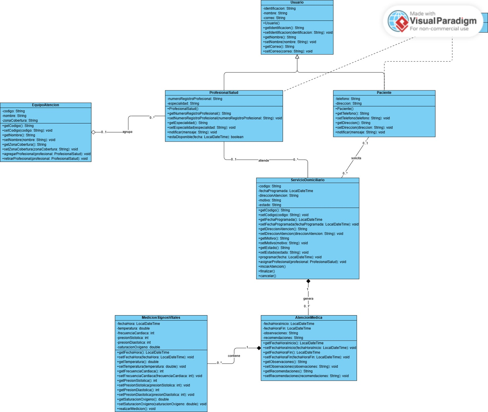

# MediHome

Sistema de atención médica domiciliaria. Implementación en Java 21 del diagrama de clases diseñado con Visual Paradigm.

## Integrantes

- Santiago Ortega Bolaños

## Diagrama de clases



- Imagen: `diagrama/Paradigm.jpeg`
- Fuente (Visual Paradigm): carpeta `diagrama/` (archivo `.vpp`)

## Ejecución

Requiere Java 21.

```bash
javac -d out src/medihome/*.java
java -cp out medihome.Main
```
